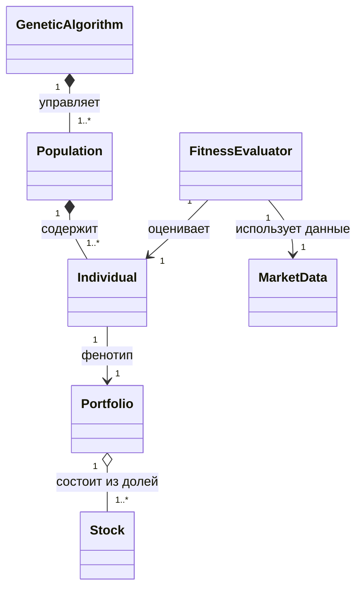

# Проектирование генетического алгоритма и онтологии для оптимизации портфеля акций

Данный документ описывает предлагаемую архитектуру генетического алгоритма (ГА) и предметную онтологию, разработанные на основе теории ГА с адаптацией под финансовую предметную область.

> [!NOTE]  
> - **Стек технологий:** Чистый Python + `numpy`, `pandas`, `matplotlib`.
> - **Целевая функция:** Максимизация коэффициента Шарпа.

## 1. Детали Генетического Алгоритма (ГА)

### 1.1. Представление генетической информации (Кодирование)
- **Ген**: Вещественное число $w_i$, представляющее долю $i$-й акции в портфеле.
- **Хромосома (Особь)**: Вектор весов $W = (w_1, w_2, ..., w_n)$, где $n$ — количество рассматриваемых акций на рынке.
- **Условие нормализации**: Сумма всех генов (весов) в хромосоме должна всегда равняться 1 ($\sum_{i=1}^n w_i = 1$). 

### 1.2. Оценка приспособленности (Фитнес-функция)
В качестве основной меры приспособленности используется **Коэффициент Шарпа** (Sharpe Ratio), который мы будем максимизировать:
$$ \text{Fitness}(W) = \frac{R_p(W) - R_f}{\sigma_p(W)} $$
Где:
- $R_p(W)$ — ожидаемая доходность портфеля при заданных весах $W$.
- $R_f$ — безрисковая ставка.
- $\sigma_p(W)$ — волатильность (стандартное отклонение) портфеля, рассчитываемая на основе ковариационной матрицы доходностей акций.

### 1.3. Генетические операторы
- **Селекция (Отбор)**: **Турнирная селекция**. Случайно выбираются $k$ особей, и из них родителем становится особь с максимальным значением фитнес-функции.
- **Кроссовер (Скрещивание)**: **Случайное слияние (сплайсинг)**. Формируется маска (или точка разрыва), и хромосома потомка образуется путем склеивания "кусков ДНК" (частей генотипа) первого и второго родителя в случайном соотношении.
- **Инверсия**: С вероятностью 1% (0.01) ДНК (хромосома) разбивается по случайной точке, и полученные части меняются местами (циклический сдвиг или сплайсинг со сменой порядка).
- **Мутация**: С вероятностью 10% (0.1) происходит мутация — замена одного случайного бита (гена) в ДНК, при которой случайно выбирается одна акция и её текущая доля (вес) заменяется на новое случайное вещественное число.
- **Нормализация**: Поскольку операции кроссовера, инверсии и мутации нарушают первоначальное условие суммы, в самом конце для каждого потомка применяется принудительная нормализация: каждый ген делится на общую сумму весов хромосомы ($\forall i, w_i = \frac{w_i}{\sum w_i}$), приводя сумму к 1.
- **Формирование нового поколения**: **Элитизм**. Лучшие особи переходят в следующее поколение без изменений, остальная часть заменяется новыми нормализованными потомками.

---

## 2. Онтология системы (Предметная область)

Онтология описывает ключевые сущности нашей системы и связи между ними для дальнейшего проектирования классов на чистом Python.

### 2.1. Классы (Сущности)
- **`Stock` (Акция)**: Конкретный финансовый актив (Тикер, Ожидаемая доходность, Волатильность).
- **`Portfolio` (Портфель)**: Конкретный набор акций с заданными весами (Общая доходность, Общий риск, Коэффициент Шарпа).
- **`MarketData` (Рыночные данные)**: Менеджер исторических данных (хранит данные в `pandas.DataFrame`) для расчета ковариационной матрицы и ожидаемых доходностей.
- **`GeneticAlgorithm` (Генетический алгоритм)**: Главный движок оптимизации.
- **`Population` (Популяция)**: Набор особей (портфелей) в рамках одного поколения.
- **`Individual` (Особь / Хромосома)**: Представление портфеля в рамках ГА (Генотип: вектор весов в виде `numpy.ndarray`).
- **`FitnessEvaluator` (Оценщик)**: Вычислитель целевой функции (Коэффициента Шарпа).

### 2.2. Отношения (Связи)

